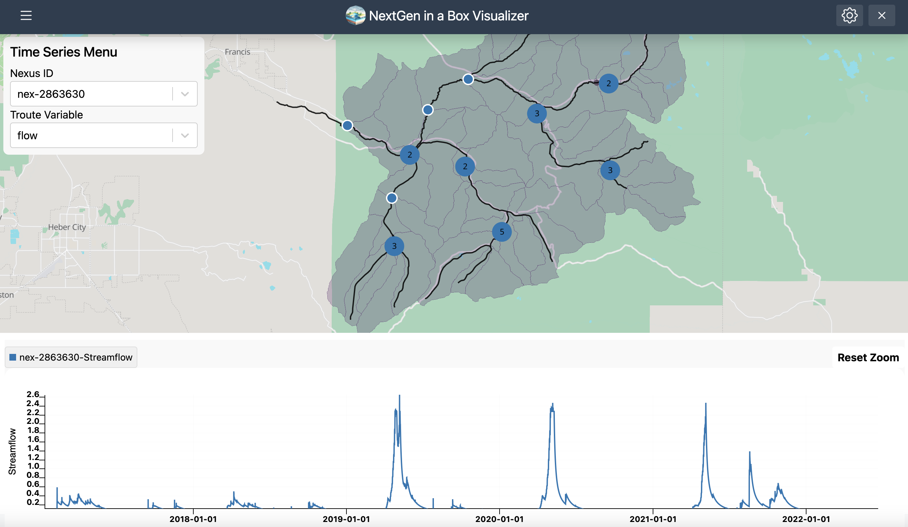
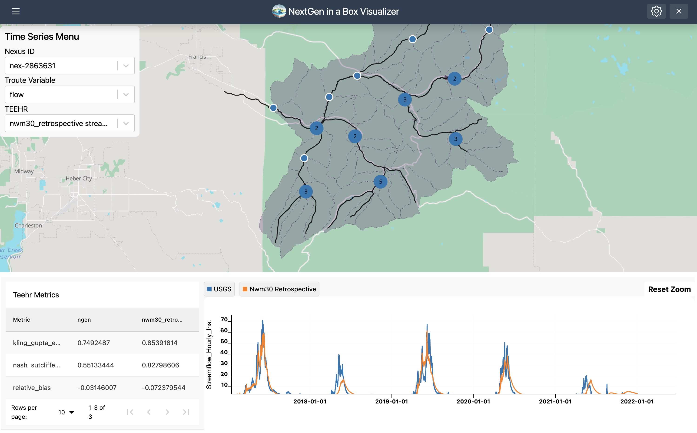

# NextGen In A Box (NGIAB)

> Run the NextGen National Water Resources Modeling Framework locally with ease.

[NGIAB](https://ngiab.ciroh.org) provides a containerized and user-friendly solution for running the NextGen framework, allowing you to control inputs, configurations, and execution on your local machine.

| | |
| --- | --- |
|  | Funding for this project was provided by the National Oceanic & Atmospheric Administration (NOAA), awarded to the Cooperative Institute for Research to Operations in Hydrology (CIROH) through the NOAA Cooperative Agreement with The University of Alabama (NA22NWS4320003). |

## Features

- **Run NextGen Locally**: Experiment with the framework on your machine
- **Control Over Inputs**: Choose specific regions/basins and modify input data
- **Simplified Setup**: Easy deployment using Docker containers
- **Open Research**: Promotes transparency through open-source tooling
- **Evaluation Tools**: Integrated TEEHR evaluation capabilities
- **Visualization**: Built-in support for output visualization via Tethys Platform

| | | |
| --- | --- | --- |
|  |  |  |

## Navigating this repository

### For general use

- **NGIAB Guide Scripts**: This repository holds several guide scripts: `guide.sh`, `runTeehr.sh`, and `viewOnTethys.sh`. These scripts are the recommended way to run NGIAB.

- **Documentation**: The [`docs/` folder](./docs/00_CONTENTS.md) contains information on all of the finer details that can help you get the most out of the contents of this repository.
  - For broader ecosystem-wide documentation, please visit DocuHub at [docs.ciroh.org/products/ngiab](https://docs.ciroh.org/products/ngiab), where all of the information from this and other NGIAB repositories is mirrored.

### For development

- `docker/`: This folder contains the Dockerfile and entrypoint for the NGIAB container. See [Section 3.1](./docs/03_01_CONTAINERS.md) of the documentation for more information.
    - Releases built from this folder are available at [https://hub.docker.com/r/awiciroh/ciroh-ngen-image](https://hub.docker.com/r/awiciroh/ciroh-ngen-image).
- `.github/`: Workflows, issue templates, and other GitHub-focused configuration files.
- `archive/`: Older files that are no longer maintained.

## Contributing

Interested in contributing? Please see our [contribution guide](05_CONTRIBUTE.md) for more information.

## Contributors
- Arpita Patel, Alabama Water Institute, CIROH (apatel54@ua.edu)
- Benjamin Lee, Alabama Water Institute, CIROH (blee60@ua.edu)
- Zach Wills, Lynker (zwills@lynker.com)
- Nels Frazier, Lynker (nfrazier@lynker.com)
- Josh Cunningham, Alabama Water Institute, CIROH (jcunningham8@ua.edu)
- Gio Romero, Aquaveo (gromero@aquaveo.com)
- Sam Lamont, RTI International (slamont@rti.org)
- Matthew Denno, RTI International (mdenno@rti.org)
- James Halgren, Alabama Water Institute, CIROH (jshalgren@ua.edu)

## Sponsorship
- NOAA Cooperative Institute for Research to Operations in Hydrology ([CIROH](https://ciroh.org))
Project: CIROH: Community Water Model Infrastructure, Stewardship, and Integration (PI - Steven Burian)
Project: [Advancing Community NextGen and NextGen In A Box (NGIAB) – Paving the Pathway to Operations](https://ciroh.ua.edu/research-projects/advancing-community-nextgen-and-nextgen-in-a-box-ngiab-paving-the-pathway-to-operations/) (PI - Arpita Patel)

## Additional resources

- [NGIAB Website](https://ngiab.ciroh.org)
- [NGIAB 101 Training Module](https://docs.ciroh.org/training-NGIAB-101/)
- [NGIAB on DocuHub](https://docs.ciroh.org/)

### Upstream repositories
- [NextGen Framework Prototype](https://github.com/NOAA-OWP/ngen)
- [Community ngen Repository](https://github.com/CIROH-UA/ngen)
- [Community troute Repository](https://github.com/CIROH-UA/t-route)

### NGIAB ecosystem
- [NGIAB Data Preprocess](https://github.com/CIROH-UA/NGIAB_data_preprocess)
- [NGIAB TEEHR Integration](https://github.com/CIROH-UA/ngiab-teehr)
- [NGIAB Data Visualizer](https://github.com/CIROH-UA/ngiab-client)
- [DataStreamCLI and Research Datastream](https://github.com/CIROH-UA/ngen-datastream/tree/main)
- [NGIAB Calibration](https://github.com/CIROH-UA/ngiab-cal)