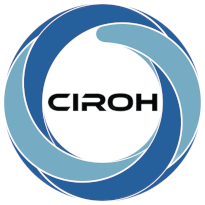

# Contact Us

NextGen In A Box is primarily developed and maintained by the [Collaborative Institute for Research to Operations in Hydrology](https://ciroh.org) (CIROH).
If you're having trouble or would like to send us feedback, please don't hesitate to do so.

## Reporting issues

If you have a bug or feature request, this repository's [issue tracker](https://github.com/CIROH-UA/NGIAB-CloudInfra/issues) is the best place to submit them.
For guidance on submitting an issue, please see the [contribution guide](./05_CONTRIBUTE.md).

## Getting help

CIROH's [monthly office hours](https://docs.ciroh.org/docs/products/ngiab/office-hours) are a great way to engage with experts, ask questions, and stay updated on the latest developments.
To join, email us at [ciroh-it-admin@ua.edu](mailto:ciroh-it-admin@ua.edu) to receive the Teams Meeting link and calendar invitation.

If you need more immediate help, we're also available via email or Slack — see below.

## General inquiries

Need to get in touch for some other reason? Please reach out!
- Email: [ciroh-it-admin@ua.edu](mailto:ciroh-it-admin@ua.edu)
- Slack: [#ciroh-ua-it-support channel](https://cirohworkspace.slack.com/archives/C057BLQB867)
  - *Note: requires access to CIROH Slack workspace*

## Funding acknowledgement

| | |
| --- | --- |
|  | Funding for this project was provided by the National Oceanic & Atmospheric Administration (NOAA), awarded to the Cooperative Institute for Research to Operations in Hydrology (CIROH) through the NOAA Cooperative Agreement with The University of Alabama (NA22NWS4320003). |